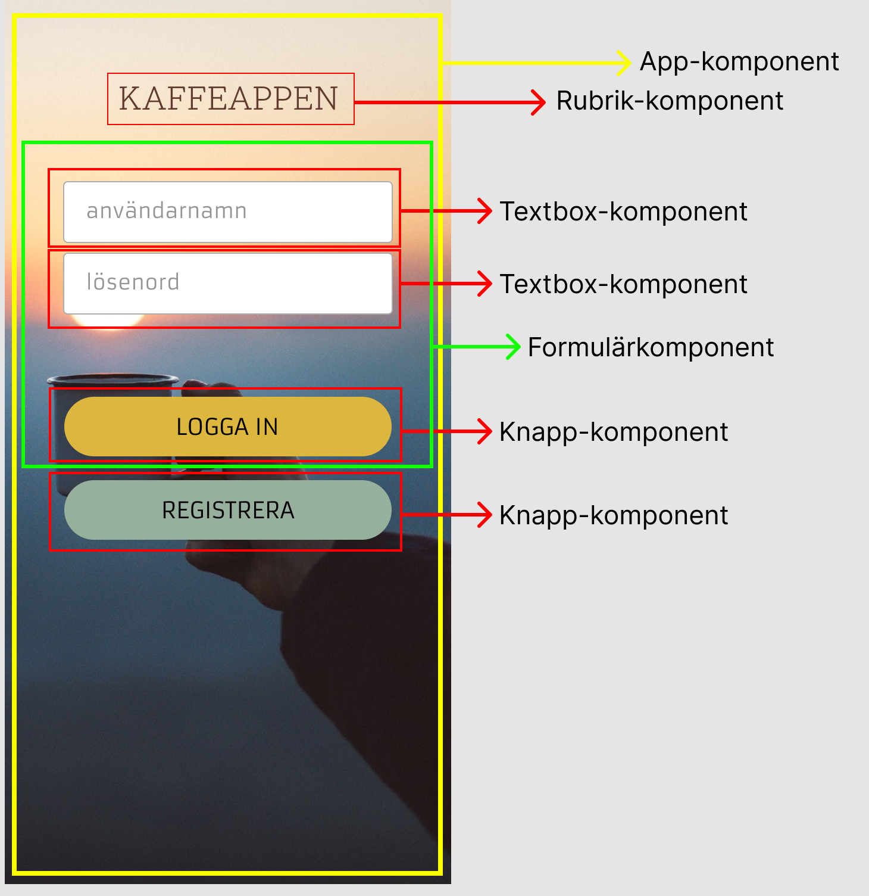
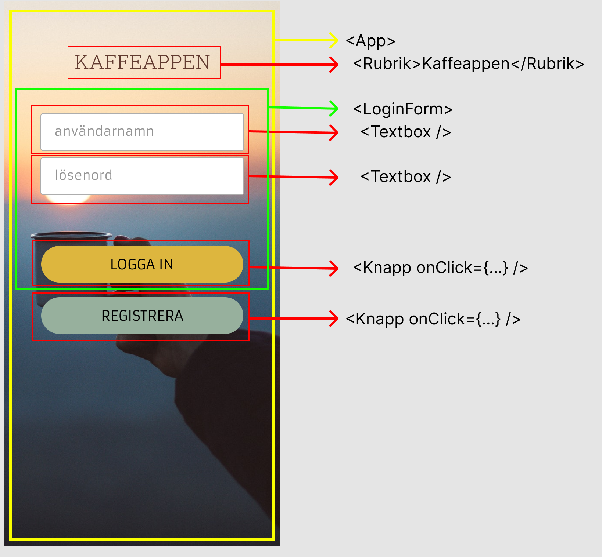

# React.js - intro

Jens Palmqvist

---

# React.js

- JavaScript-bibliotek för att bygga användargränssnitt
- Lanserades 2013 av Facebook
- Open source
- Single Page Application (SPA)
- Komponentbaserat

---

# En applikation av komponenter

- En React-applikation består av komponenter
- En komponent kan i sin tur innehålla andra komponenter
- På så sätt kan vi få en välstrukturerad kod

---

<!-- # Vad är en komponent?

Är precis som en funktion en *oberoende* och *återanvändningsbar* kodbit men där slutresultatet är HTML.

--- -->


---



---



---

# Komponentstruktur i kod


```html
<App>
    <Rubrik>Kaffeappen</Rubrik>
    <LoginForm>
        <Textbox />
        <Textbox />
        <Knapp onClick={...} />
    </LoginForm>
    <Knapp onClick={...} />
</App>

```

---
# Hur skapar man en React-komponent?

- En react-komponent är en helt vanligt JavaScript-funktion
- Resultatet av funktionen - det som returneras - skrivs ut som **HTML**
- Utvecklaren bestämmer vad komponenten ska heta - välj ett beskrivande namn!

```js
const BildKomponent = () => (
    
)
```

---

# Hur använder vi en komponent?

```js
//Komponentens kod
const BildKomponent = () => 
```

```jsx
<!-- Används genom att skriva komponentens namn i en HTML-tagg -->
<BildKomponent />
```

```html
<!-- Resultat i HTML -->

```

---

# JSX - Javascript XML

- Med hjälp av JSX kan vi skriva ut HTML från en React-komponent
- Som HTML men med några skillnader:
    - Man skriver className istället för class
    - Man kan varva HTML-kod med JavaScript-kod
      - För att skriva ut JS används måsvingar {}
---

# Några viktiga saker att tänka på

- En React-komponent kan bara returnera ett element. Det elementet kan i sin tur innehålla andra element (children)
- Alla HTML-element i en React-komponent måste stängas. Glöm inte stängningstaggen (eller använd självstängande komponent)

```html
<h1>Rubrik</h1> <!-- Element med stängningstagg -->
 <!-- Självstängande element -->
```

---

# Komma igång med React i HTML

- För att kunna använda React i en vanlig HTML-fil behöver vi:
  - Babel som transpilerar vår ES6-kod till JavaScript
  - React
- För detta har vi en boilerplate...
\
\
\
\
*Senare kommer vi att sätta upp en mer ordentlig React-miljö med hjälp av Create React App*

---

# React boilerplate

```html
<!DOCTYPE html>
<html>
  <head>
    <script src="https://unpkg.com/react@17/umd/react.development.js" crossorigin></script>
    <script src="https://unpkg.com/react-dom@17/umd/react-dom.development.js" crossorigin></script>
    <script src="https://unpkg.com/@babel/standalone/babel.min.js"></script>
  </head>
  <body>
    <div id="mydiv"></div>
    <script type="text/babel">
      const Hello = () => {
        return <h1>Hello World!</h1>;
      }
      ReactDOM.render(<Hello />, document.getElementById('mydiv'))
    </script>
  </body>
</html>
```

---

# Övning - En första React-komponent

- Använd boilerplatekoden så du kan köra en React-komponent i en HTML-fil
- Skapa en komponent som heter *Title* som skriver ut texten 'Kaffeappen' i en H1:a
- Ändra ReactDOM.render( ... ) så att den renderar din nya komponent

Det ska resultera i följande HTML:

```html
<h1>Kaffeappen</h1>
```

---

# Kod före return

- En komponent kan innehålla kod före den returnerar JSX
- På så sätt kan man lägga in logik som komponenten behöver innan man
- För att sätta ett HTML-attribut till en javascriptvariabel används *måsvingar* istället för *fnuttar*

```js
const BildKomponent = () => {  
    const imageUrl = "bild.png";
    return 
}
```
---

# Varva HTML och JavaScript

- För att lägga in JavaScript-kod i JSX ska den ligga mellan måsvingar { ... }
- Koden kan vara en enkel variabel men även en längre kodsnutt

```js
const BildText = () => {
    const animalType = "fågel";
    const speed = 20; //kilometer i timmen;

    return (<p>Bilden visar en {animalType}.
            Den kan flyga i {speed} km/h vilket
            motsvarar { speed * 3,6 } m/s.</p>);
}
```

---

# Övning - Varva HTML och JS

- Kopiera över nedanstående kod till din html-fil

```js
const OrderConfirmationText = () => {
    const typeOfCoffee = 'Arabicabönor';
    const amount = 0.1; //kg
    return ???
}
```
- Ändra ReactDOM.render( ... ) så att den här visas istället
- Lägg till kod efter return så att resultatet blir:

```html
<p>Tack för din beställning av 100 gram Arabicabönor</p>
```


---

# Kombinera ihop komponenter

- Komponenter kan ligga i andra komponenter
- *Förälderkomponent (parent)*  är den som har andra komponenter i sig
- *Barnkomponent (child)* är den som ligger i en annan komponent
- En komponent kan vara både förälder och barn samtidigt!

```jsx
const BildMedText = () => (
  <div>
    <BildKomponent />
    <BildText />
  </div>
)
```

---

# React fragment

- En React-komponent kan bara returnera **ett** element
- För att returnera flera element måste de ligga i ett annat element
- Det skulle kunna vara en div eller span
- Vill man inte att det ska vara ett html-element som renderas till DOM:en kan man använda React.Fragment ( eller dess shorthand <></>):

```jsx
  <>
    <BildKomponent />
    <BildText />
  </>
```


---

# Övning - Kombinera komponenter

1. Skapa en ny komponent som heter *OrderConfirmation*
2. Ändra ReactDOM.render( ... ) så att den komponenten visas på sidan
3. Returnera ett React-fragment som innehåller dina tidigare komponenter *Title* och *OrderConfirmationText*